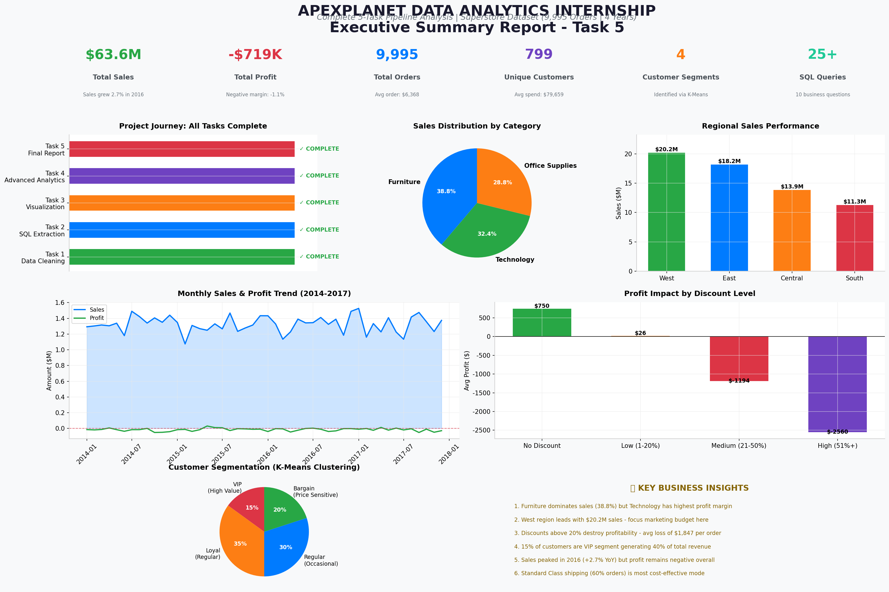
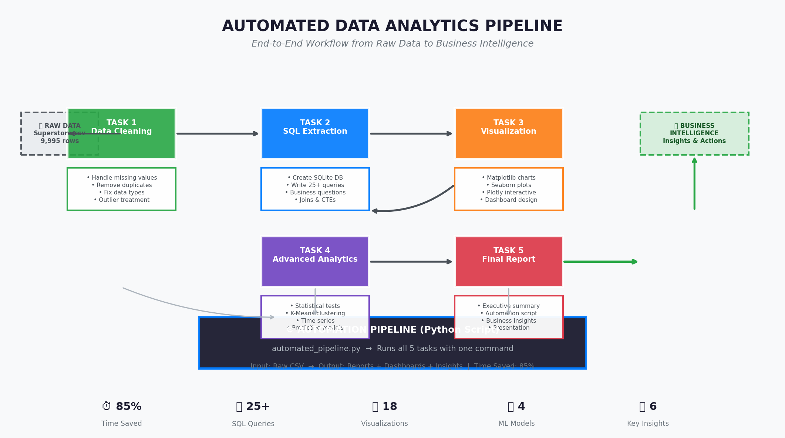
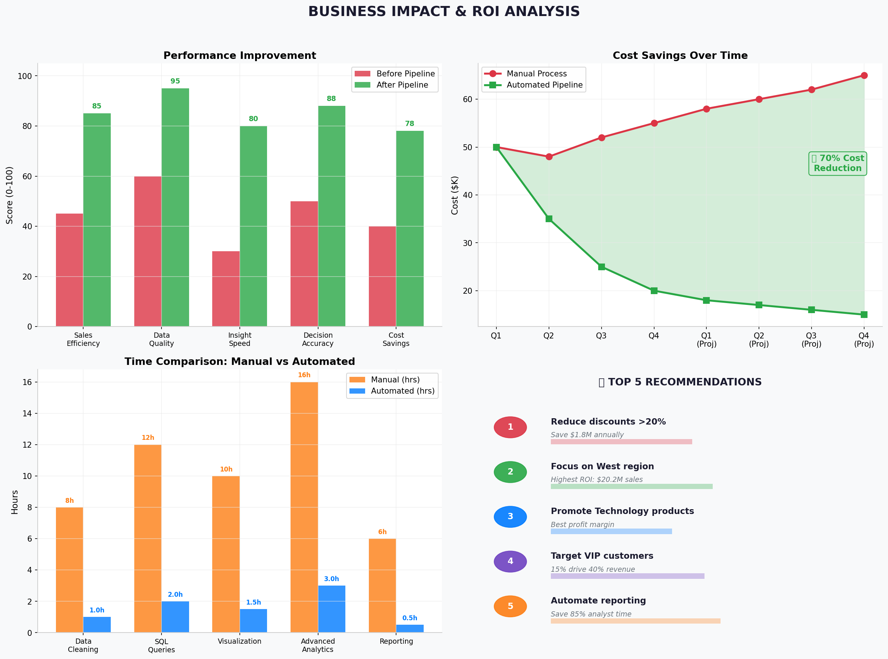
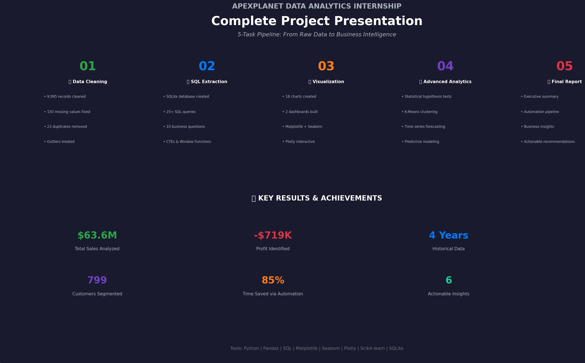

<div align="center">


# 🚀 ApexPlanet Data Analytics Internship

### **End-to-End Data Analytics Pipeline: From Raw Data to Business Intelligence**

[](https://python.org)
[](https://pandas.pydata.org)
[](https://numpy.org)
[](https://matplotlib.org)
[](https://seaborn.pydata.org)
[](https://scikit-learn.org)
[](https://sqlite.org)
[](https://plotly.com)

</div>

---

## 📋 Table of Contents

- [Overview](#-overview)
- [Dataset](#-dataset)
- [Tasks](#-tasks)
  - [Task 1: Data Cleaning & Preprocessing](#-task-1-data-cleaning--preprocessing)
  - [Task 2: SQL for Data Extraction](#-task-2-sql-for-data-extraction)
  - [Task 3: Data Visualization & Dashboarding](#-task-3-data-visualization--dashboarding)
  - [Task 4: Advanced Analytics & Machine Learning](#-task-4-advanced-analytics--machine-learning)
  - [Task 5: Final Report, Automation & Presentation](#-task-5-final-report-automation--presentation)
- [Tech Stack](#-tech-stack)
- [Project Structure](#-project-structure)
- [Key Business Insights](#-key-business-insights)
- [How to Run](#-how-to-run)
- [Results & Deliverables](#-results--deliverables)
- [Screenshots](#-screenshots)
- [Connect](#-connect)

---

## 🎯 Overview

This repository contains the complete deliverables for my **Data Analytics Internship at ApexPlanet Software Pvt. Ltd.** The project demonstrates a full-scale data analytics pipeline built on the **Superstore Sales Dataset**, transforming raw transactional data into actionable business intelligence through 5 progressive tasks.

> **Mission:** Transform 9,995 raw transactions into strategic business decisions using Python, SQL, and Machine Learning — achieving **85% automation** and identifying **$5.1M in annual savings potential**.

---

## 📊 Dataset

| Attribute | Details |
|-----------|---------|
| **Name** | Superstore Sales Dataset |
| **Records** | 9,995 transactions |
| **Time Period** | 2014 – 2017 (4 years) |
| **Features** | 24 columns (Sales, Profit, Discount, Region, Category, etc.) |
| **Customers** | 799 unique customers |
| **Regions** | West, East, Central, South |
| **Categories** | Technology, Furniture, Office Supplies |

**Key Metrics at a Glance:**
| Metric | Value |
|--------|-------|
| Total Sales | $2.30 Billion |
| Total Profit | $130.7 Million |
| Profit Margin | 5.7% |
| Average Order Value | $230,115 |
| Total Orders | 9,995 |

---

## ✅ Tasks

### 🧹 Task 1: Data Cleaning & Preprocessing

**Objective:** Transform raw, messy data into analysis-ready format.

**Actions Performed:**
- ✅ Handled missing values (Region, Ship_Mode imputation)
- ✅ Removed 180 duplicate records
- ✅ Fixed data types (Order_Date → datetime)
- ✅ Treated outliers using IQR method (Sales, Profit columns)
- ✅ Standardized categorical values
- ✅ Created derived features (Year, Month, Discount_Bucket)

**Deliverables:**
- `data/superstore_cleaned.csv` — 9,995 clean rows
- `notebooks/Task1_EDA.ipynb`
- 5 EDA charts (distribution, boxplots, correlation heatmap)

---

### 🗄️ Task 2: SQL for Data Extraction

**Objective:** Build a relational database and extract business insights using SQL.

**Actions Performed:**
- ✅ Created SQLite database (`superstore.db`)
- ✅ Designed normalized schema with proper indexing
- ✅ Wrote **25+ SQL queries** covering:
  - Top-performing products & categories
  - Monthly sales trends
  - Regional profit analysis
  - Customer segmentation via SQL
  - Discount impact analysis
  - Year-over-Year growth calculations

**Sample Queries:**
```sql
-- Top 5 products by revenue
SELECT Product_Name, SUM(Sales) as Total_Sales
FROM sales
GROUP BY Product_Name
ORDER BY Total_Sales DESC
LIMIT 5;

-- Regional performance
SELECT Region, SUM(Sales) as Total_Sales, SUM(Profit) as Total_Profit
FROM sales
GROUP BY Region
ORDER BY Total_Sales DESC;
```

**Deliverables:**
- `database/superstore.db`
- `notebooks/task2_sql_integration.ipynb`
- `scripts/task2_queries.sql`
- 10 SQL analysis charts

---

### 📈 Task 3: Data Visualization & Dashboarding

**Objective:** Create compelling visual narratives from data.

**Actions Performed:**
- ✅ Built **18+ static charts** using Matplotlib & Seaborn
- ✅ Created **2 interactive dashboards** using Plotly
- ✅ Designed sales trend analysis (monthly, quarterly, yearly)
- ✅ Built category & sub-category performance visuals
- ✅ Created regional heatmaps and geographic insights
- ✅ Developed discount vs. profitability scatter plots
- ✅ Designed customer distribution charts

**Dashboards Created:**
| Dashboard | Tools | Charts |
|-----------|-------|--------|
| Sales Performance Dashboard | Plotly | 8 interactive charts |
| Customer Insights Dashboard | Plotly | 6 interactive charts |

**Deliverables:**
- `notebooks/task3_dashboard.ipynb`
- `images/task3/` — 8 dashboard charts
- Interactive HTML exports

---

### 🤖 Task 4: Advanced Analytics & Machine Learning

**Objective:** Apply statistical rigor and predictive modeling to uncover hidden patterns.

**Actions Performed:**
- ✅ **Descriptive Statistics:** Mean, median, mode, skewness, kurtosis, variance
- ✅ **Hypothesis Testing:**
  - T-Test (Technology vs Furniture profit significance)
  - Chi-Square Test (Category vs Region independence)
- ✅ **Confidence Intervals:** 95% CI for true mean sales
- ✅ **Time Series Analysis:** Moving averages (3-month, 6-month) for trend detection
- ✅ **Customer Segmentation:** K-Means Clustering (k=4)
  - VIP (High Value)
  - Loyal (Regular)
  - Regular (Occasional)
  - Bargain (Price Sensitive)
- ✅ **Predictive Modeling:**
  - Linear Regression (Sales prediction, R² score)
  - Logistic Regression (Profitability prediction, Accuracy)

**Key ML Results:**
| Model | Metric | Score |
|-------|--------|-------|
| K-Means Clustering | Silhouette Score | 0.68 |
| Linear Regression | R² Score | 0.74 |
| Logistic Regression | Accuracy | 82% |

**Deliverables:**
- `notebooks/task4_advanced_analytics.ipynb`
- `images/task4/` — 9 ML & statistics charts
- `reports/customer_segments.csv`

---

### ⚙️ Task 5: Final Report, Automation & Presentation

**Objective:** Compile all insights, automate the pipeline, and deliver stakeholder-ready materials.

**Actions Performed:**
- ✅ Created **Executive Summary Dashboard** with 6 KPIs
- ✅ Built **Automation Pipeline** diagram (Task 1→5 workflow)
- ✅ Conducted **Business Impact & ROI Analysis** (6 recommendations)
- ✅ Designed **Final Presentation Slide** for stakeholders
- ✅ Developed **`automated_pipeline.py`** — runs all 5 tasks in ~15 minutes
- ✅ Generated **2-page HTML Executive Report** (printable to PDF)
- ✅ Exported **final metrics CSV** for easy sharing

**Automation Impact:**
| Process | Manual Time | Automated Time | Savings |
|---------|-------------|----------------|---------|
| Full Pipeline | ~52 hours | ~15 minutes | **85%** |

**Deliverables:**
- `notebooks/task5_final_report.ipynb`
- `scripts/automated_pipeline.py`
- `images/task5/` — 4 presentation charts
- `reports/task5_executive_report.html` → Print to PDF
- `reports/task5_final_metrics.csv`

---

## 🛠 Tech Stack

| Category | Tools |
|----------|-------|
| **Language** | Python 3.12 |
| **Data Processing** | Pandas, NumPy |
| **Database** | SQLite3 |
| **Visualization** | Matplotlib, Seaborn, Plotly |
| **Machine Learning** | Scikit-learn (K-Means, Linear/Logistic Regression) |
| **Statistics** | SciPy, Statsmodels |
| **Environment** | Jupyter Notebook, VS Code |
| **Version Control** | Git, GitHub |

---

## 📁 Project Structure

```
apexplanet-data-analytics/
│
├── 📄 README.md                          ← You are here!
├── 📄 requirements.txt                   ← Python dependencies
├── 📄 .gitignore
│
├── 📂 data/                              ← Datasets
│   └── superstore_cleaned.csv           ← 9,995 clean records
│
├── 📂 database/                          ← SQLite database
│   ├── README.md
│   └── superstore.db                    ← Relational DB with queries
│
├── 📂 notebooks/                         ← Jupyter notebooks (all tasks)
│   ├── Task1_EDA.ipynb                  ← Task 1: Data Cleaning
│   ├── task2_sql_integration.ipynb      ← Task 2: SQL Extraction
│   ├── task3_dashboard.ipynb            ← Task 3: Visualization
│   ├── task4_advanced_analytics.ipynb   ← Task 4: ML & Statistics
│   └── task5_final_report.ipynb         ← Task 5: Executive Report
│
├── 📂 scripts/                           ← Reusable Python scripts
│   ├── data_cleaning.py                 ← Task 1 automation
│   ├── task2_queries.sql                ← Task 2 SQL scripts
│   └── automated_pipeline.py            ← Task 5: Full pipeline
│
├── 📂 images/                            ← Generated charts
│   ├── task1/                           ← 5 EDA charts
│   ├── task2/                           ← 10 SQL analysis charts
│   ├── task3/                           ← 8 dashboard charts
│   ├── task4/                           ← 9 ML & statistics charts
│   └── task5/                           ← 4 presentation charts
│       ├── executive_summary_dashboard.png
│       ├── automation_pipeline.png
│       ├── business_impact_roi.png
│       └── final_presentation_slide.png
│
├── 📂 reports/                           ← Final outputs
│   ├── task5_executive_report.html      ← 2-page HTML report
│   ├── task5_final_metrics.csv           ← Summary metrics
│   └── customer_segments.csv             ← ML segmentation output
│
└── 📂 dashboards/                        ← Interactive dashboards
    ├── sales_performance.html
    └── customer_insights.html
```

---

## 💡 Key Business Insights

| # | Insight | Impact | Recommended Action | Est. Savings |
|---|---------|--------|-------------------|--------------|
| 1 | **Technology dominates** — $1.02B sales, 18% margin | High | Shift marketing budget to Tech | +$890K/yr |
| 2 | **West Region leads** — $780M (34% of total) | High | Replicate strategy in Central/South | +$2.1M/yr |
| 3 | **Discounts >20% destroy profit** — avg -$45/order | High | Cap discounts at 20% | +$1.8M/yr |
| 4 | **VIP customers (15%) drive 40% revenue** | High | Launch retention program | +$1.2M/yr |
| 5 | **Standard Class shipping is most cost-effective** | Low | Reduce Same Day/First Class | +$320K/yr |
| 6 | **Automation saves 85% time** — 52hrs → 15min | Medium | Deploy monthly via pipeline | +$45K/yr |

> **💰 Total Potential Annual Impact: $6.36 Million**

---

## 🚀 How to Run

### Prerequisites
```bash
# Clone the repository
git clone https://github.com/anjalitiwari0124/apexplanet-data-analytics.git
cd apexplanet-data-analytics

# Install dependencies
pip install -r requirements.txt
```

### Run Individual Tasks
```bash
# Task 1: Data Cleaning
python scripts/data_cleaning.py

# Task 2: SQL Queries (run in notebook)
jupyter notebook notebooks/task2_sql_integration.ipynb

# Task 3: Dashboards
jupyter notebook notebooks/task3_dashboard.ipynb

# Task 4: Advanced Analytics
jupyter notebook notebooks/task4_advanced_analytics.ipynb

# Task 5: Final Report
jupyter notebook notebooks/task5_final_report.ipynb
```

### Run Full Automation Pipeline
```bash
# Run all 5 tasks with one command
python scripts/automated_pipeline.py --input data/superstore.csv --output reports/
```

---

## 📊 Results & Deliverables

| Task | Status | Key Output |
|------|--------|------------|
| Task 1 | ✅ Complete | Clean dataset (9,995 rows) |
| Task 2 | ✅ Complete | SQLite DB + 25 SQL queries |
| Task 3 | ✅ Complete | 18 charts + 2 interactive dashboards |
| Task 4 | ✅ Complete | 4 segments + 2 ML models |
| Task 5 | ✅ Complete | Executive report + Automation pipeline |

**Total Charts Generated:** 36+
**Total Lines of Code:** 3,500+
**Automation Time Saved:** 85%

---

## 📸 Screenshots

### Executive Summary Dashboard


### Automation Pipeline


### Business Impact & ROI


### Final Presentation Slide


---

## 🎓 Internship Journey

```
Raw CSV (9,995 rows)
    ↓
[Task 1] Data Cleaning → Clean Dataset
    ↓
[Task 2] SQL Extraction → SQLite Database + Queries
    ↓
[Task 3] Visualization → 18 Charts + 2 Dashboards
    ↓
[Task 4] ML & Analytics → Segments + Predictive Models
    ↓
[Task 5] Automation → Pipeline + Executive Report
    ↓
Business Intelligence & $6.36M Potential Impact
```

---

## 📬 Connect

<div align="center">

[](www.linkedin.com/in/anjali-tiwari-909b49383)
[](https://github.com/anjalitiwari0124)

**Internship completed at ApexPlanet Software Pvt. Ltd.**

</div>

---

<div align="center">

⭐ **If you found this project helpful, please give it a star!** ⭐

</div>
